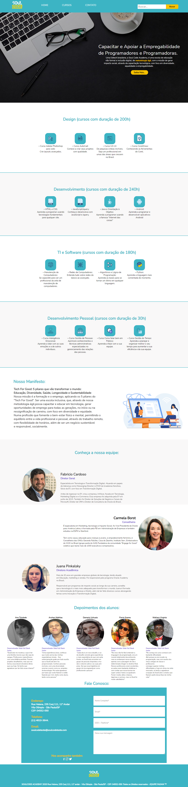

# Projeto-HTML

Projeto Final do Módulo de HTML da [SoulCode Academy](https://soulcodeacademy.org/) - O intuito do projeto foi apresentar uma nova proposta para o site da SoulCode. 

---
**Tecnologias utilizadas:** HTML e CSS.

 
  
  

 Projeto Desenvolvido em Grupo: @Aruhan-Mathias @Ana @Damaris @Flavia @Wallace-Virginio  

